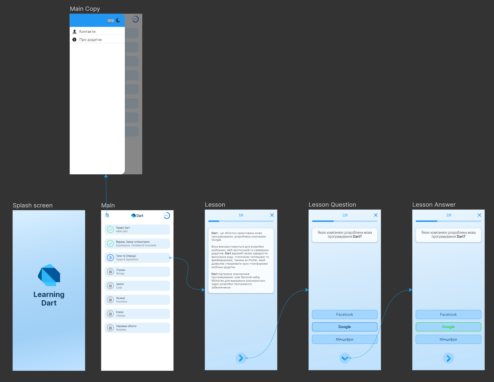

# DartLearn
Інтерактивний мобільний додаток, спеціально розроблений для тих, хто бажає вивчити мову програмування Dart в зручному та доступному форматі. 

 
 
  
App UI

  
 

 
 
  
Bloc

  
 

  
 
  
Navigation

  
 

  
 
  
Network

  
 
